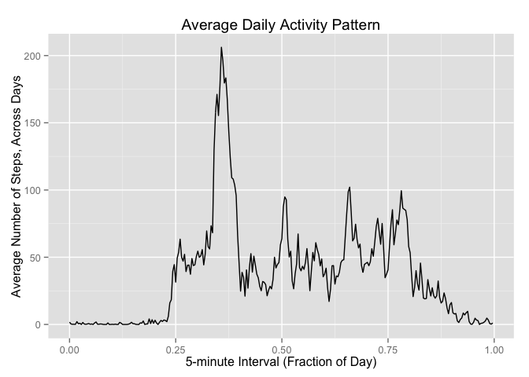
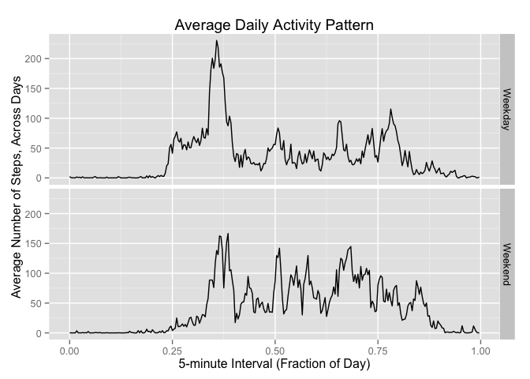

# Reproducible Research: Peer Assessment 1


```
## 
## Attaching package: 'dplyr'
## 
## The following objects are masked from 'package:stats':
## 
##     filter, lag
## 
## The following objects are masked from 'package:base':
## 
##     intersect, setdiff, setequal, union
```
## Loading and preprocessing the data
In the first step of this assignment, we load and process the data to make it suitable for analysis.


```r
activity <- read.csv("../activity.csv")
activity$date <- as.Date(activity$date,format = "%Y-%m-%d") # Make date class of date 
activity$interval <- ifelse(nchar(activity$interval) == 1,paste0("000",activity$interval),activity$interval)
activity$interval <- ifelse(nchar(activity$interval)==2,paste0("00",activity$interval),activity$interval)
activity$interval <- ifelse(nchar(activity$interval)==3,paste0("0",activity$interval),activity$interval)
activity$interval <- (as.numeric(substr(activity$interval,1,2)) * 60 + 
                          as.numeric(substr(activity$interval,3,4))) / 1440 # Get interval in terms of fraction of day
```

## What is mean total number of steps taken per day?
Now, we can determine the mean total number of steps taken per day. We will ignore the missing data and make a histogram of the total number of steps taken each day. 


```r
by_day <- group_by(activity,date) %>%
  summarise(total_steps = sum(steps,na.rm=TRUE))
qplot(total_steps, 
      data = by_day, 
      geom = "histogram",
      fill = ..count..,
      binwidth = 800,
      main = "Histogram of Total Steps Taken Each Day (Oct. 1, 2012 to Nov. 30, 2012)",
      xlab = "Total Steps",
      ylab = "Frequency")
```

 

Next, we can calculate the mean and median total number of steps taken per day.


```r
data.frame(mean = mean(by_day$total_steps), median = quantile(by_day$total_steps,probs = 0.5))
```

```
##        mean median
## 50% 9354.23  10395
```

We see the mean total number of steps taken per day is 9354.23 and the median is 1.0395\times 10^{4}. 

## What is the average daily activity pattern?
To see the average daily activity pattern, we make a time-series plot of the 5-minute interval and the average number of steps taken, averaged across all days.


```r
by_interval <- group_by(activity,interval) %>%
  summarise(mean_steps = mean(steps,na.rm = TRUE))
ggplot(by_interval, aes(interval, mean_steps)) + geom_line() +
  xlab("5-minute Interval (Fraction of Day)") + ylab("Average Number of Steps, Across Days") + 
  labs(title = "Average Daily Activity Pattern")
```

 

Now, we find which 5-minute interval, on average across all days in the dataset, contains the maximum number of steps.


```r
times(by_interval[which.max(by_interval$mean_steps),1])
```

```
## [1] 08:35:00
```

We see that it is the 5-minute interval starting at 0.3576389.

## Imputing missing values
There are missing values in the dataset. Let's see how many there are.


```r
sum(is.na(activity$steps))
```

```
## [1] 2304
```

There are 2304 missing values in the dataset. We can impute the missing values by using the mean for the 5-minute interval where the data is missing.


```r
where_na <- is.na(activity$steps)
activity$steps[where_na] <- rep(by_interval$mean_steps,61)[where_na]
```

We again make a histogram of the number of steps taken each day and calculate and report the mean and median number of steps taken per day, this time with the imputed missing data.


```r
by_day2 <- group_by(activity,date) %>%
  summarise(total_steps = sum(steps,na.rm=TRUE))
qplot(total_steps, 
      data = by_day2, 
      geom = "histogram",
      fill = ..count..,
      binwidth = 800,
      main = "Histogram of Total Steps Taken Each Day (Oct. 1, 2012 to Nov. 30, 2012)",
      xlab = "Total Steps",
      ylab = "Frequency")
```

 

```r
data.frame(mean = mean(by_day2$total_steps), median = quantile(by_day2$total_steps,probs = 0.5))
```

```
##         mean   median
## 50% 10766.19 10766.19
```

Now, the mean number of steps taken per day is 1.076619\times 10^{4} and the median is 1.0766189\times 10^{4}. These values both differ from the case when we ignored the missing data; they are higher. Imputing missing data increases the estimates of the total daily number of steps, since the once-missing data are no longer ignored (essentially set to zero), but now can have a positive value. 

## Are there differences in activity patterns between weekdays and weekends?
We can create a new factor variable in the dataset indicating whether or not a given date is a weekday or a weekend.


```r
activity$day <- weekdays(activity$date)
activity$day <- ifelse(activity$day %in% c("Saturday","Sunday"),"Weekend","Weekday") %>%
    as.factor
```

Now, we make a panel plot containing a time-series plot of the 5-minute interval and the average number of steps taken, averaged across all weekday days or weekend days.


```r
by_interval2 <- regroup(activity,list(quote(day),quote(interval))) %>%
  summarise(mean_steps = mean(steps))
ggplot(by_interval2, aes(interval, mean_steps)) + geom_line() +
    facet_grid(day ~ .) +
  xlab("5-minute Interval (Fraction of Day)") + ylab("Average Number of Steps, Across Days") + 
  labs(title = "Average Daily Activity Pattern")
```

 


```
## [1] 09:15:00
```


It looks like the activity pattern is slightly different on weekends and weekdays. People start moving around later and stay active later on weekends. The maximum activity level occurs at 0.3854167, nearly an hour later than on weekdays. 


